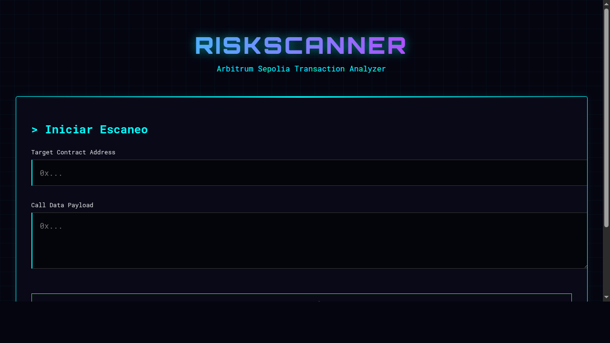

# 🌐 Risk Scanner Frontend

Interfaz de usuario moderna con estilo **Cyberpunk** para el análisis de riesgos de transacciones en Arbitrum Sepolia.



## ✨ Características

- **Estética Cyberpunk**: Paleta de colores neón (Cyan/Pink/Green) y fondo oscuro.
- **Componentes React**:
  - `TransactionForm`: Entrada de datos y validación.
  - `RiskAnalysis`: Visualización de resultados con Markdown renderizado.
  - `Spinner`: Indicador de carga animado personalizado.
- **Integración API**: Conectado directamente al backend Rust (`localhost:8080`).

## 🚀 Inicio Rápido

Asegúrate de que el backend Rust esté corriendo en el puerto 8080.

1. **Instalar dependencias**:
   ```bash
   npm install
   ```

2. **Iniciar servidor de desarrollo**:
   ```bash
   npm run dev
   ```

3. **Construir para producción**:
   ```bash
   npm run build
   ```

## 🛠️ Tecnologías

- **Vite**: Build tool ultrarrápido.
- **React**: Biblioteca UI.
- **React Markdown**: Renderizado seguro de respuestas de IA.
- **CSS3**: Variables CSS y animaciones personalizadas (sin frameworks pesados).

## 🎨 Personalización

Los estilos globales se encuentran en `src/index.css`. Puedes ajustar las variables CSS para cambiar la paleta de colores:

```css
:root {
  --neon-green: #39ff14;
  --neon-pink: #ff00ff;
  --neon-cyan: #00ffff;
  /* ... */
}
```
